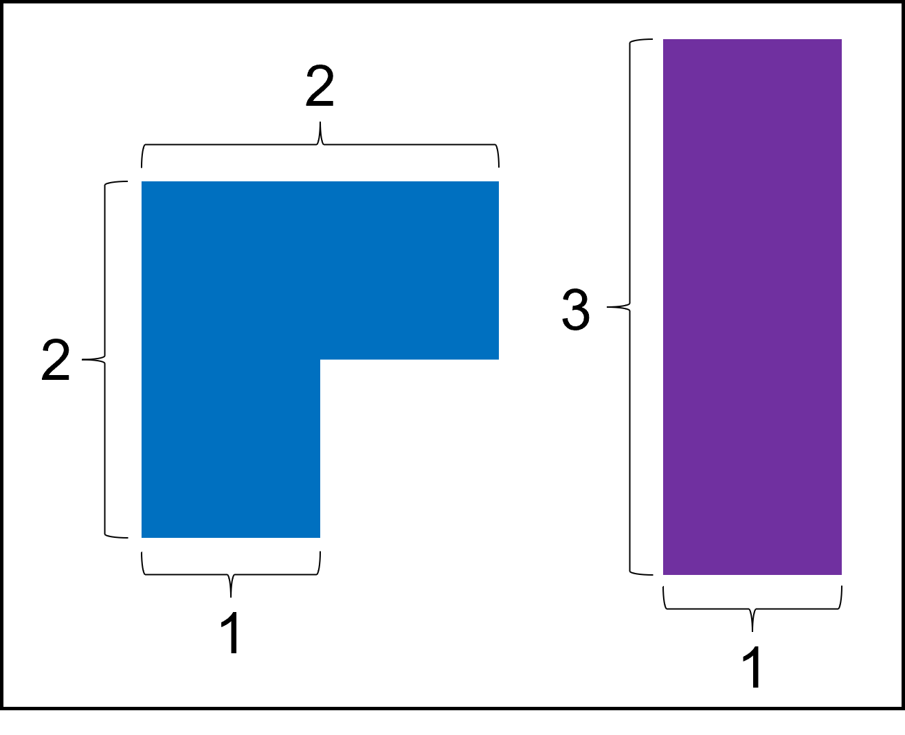

## 아방가르드 타일

### 문제

- https://school.programmers.co.kr/learn/courses/30/lessons/181186
- 가로 길이 n, 세로 길이 3인 판을 타일링
- 타일 종류

- 각 타일은 90도씩 회전할 수 있고, 개수 제한은 없음
- n이 주어졌을 때 타일링하는 방법의 수를 1,000,000,007로 나눈 나머지 return
  - 1 <= n <= 100,000
